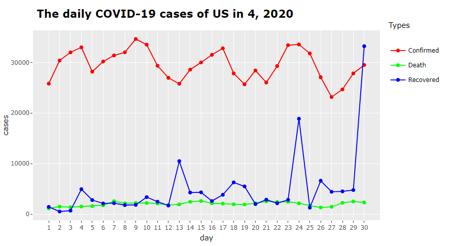

<!-- README.md is generated from README.Rmd. Please edit that file -->

```{r, include = FALSE}
knitr::opts_chunk$set(
  collapse = TRUE,
  comment = "#>",
  fig.path = "man/figures/README-",
  out.width = "100%"
)
```

# launchshiny
<!-- badges: start -->
<!-- badges: end -->

The goal of _launchshiny_ is to decompose the Shiny app in order to investigate the components of that app and help users to understand how the app run. The app could be decomposed into three parts, which are run the app, the user interface-side logic and the server-side logic. The part of running the app has been transformed into the *launch_app* function. The user interface-side logic has been refactored as the functions of *select_country_month* and *select_country_months*. While, the server-side logic has been refactored as the functions of *create_cases_table* and *plot_country_daily_cases*.

## Installation

You can install the _launchshiny_ package by _git clone_ from [GitHub]().

Or, you can install by the following command:

``` {r install, eval = FALSE}
# If you did not install the devtools, install it first.
# install.packages("devtools")
devtools::install_github("etc5523-2020/r-package-assessment-jluo0015")
```
## Overviews

There are five functions available in the _launchshiny_ package, which are:

- launch_app()
- select_country_month()
- select_country_months()
- plot_country_daily_cases()
- create_cases_table()

### The run app function

**launch_app()** function is used to run the app. It will returns the Shiny app automatically. You should command like:

```{r run-app, eval = FALSE}
launch_app() # library(launchshiny) first
```

### The user interface-side logic function

**select_country_month()** and **select_country_months()** are the two functions refactor the user interface-side logic of the app. **select_country_month()** will return the data of daily cases within a month, while **select_country_months()** function will return the data of monthly cases. They like the function to select and filter the data, and they will return the data in the table format.

There 7 variables in the return of _select_country_month()_ function:

|Variable     |Description                                     |
|-------------|------------------------------------------------|
|country      |Name of the country.                            |
|year         |The number of year.                             |
|month        |The number of month                             |
|day          |The number of day.                              |
|confirmed    |The number of daily confirmed cases of COVID-19.|
|death        |The number of daily mortality of COVID-19.      |
|recovered    |The number of daily recovered cases of COVID-19.|


There 8 variables in the return of _select_country_months()_ function:

|Variable            |Description                                                                |
|--------------------|---------------------------------------------------------------------------|
|country             |Name of the country.                                                       |
|months              |The range of months. Each row represent a month.                           |
|confirmed           |Monthly confirmed cases of COVID-19 .                                      |
|death               |Monthly mortality of COVID-19.                                             |
|recovered           |Monthly recovered cases of COVID-19.                                       |
|cumulative_confirmed|Cumulative confirmed cases of current month, which calculated from January.|
|cumulative_death    |Cumulative mortality of current month, which calculated from January.      |
|cumulative_recovered|Cumulative recovered cases of current month, which calculated from January.|

You should command like:

```{r select-function, eval = FALSE}
# To investigate the daily cases of Australia in August.
select_country_month("Australia", 8)

#To investigate the monthly cases of Japna from January to October
select_country_months(country_select = "Japan", start_month = 1, end_month = 10)
```

### The server-side logic function

**plot_country_daily_cases()** and **create_cases_table()** are the two functions refactor the server-side logic of the app. The **plot_country_daily_cases()** function will return a line chart in plotly format to show the fluctuation of the daily COVID-19 cases of a country in a selected month. While, the **create_cases_table()** function will return a table to display the daily or monthly COVID-19 cases of a country or a province, as well as the cumulative COVID-19 cases. 

You could command like:

```{r plot, eval=FALSE}
# To investigate the daily cases of US in April.

launchshiny::plot_country_daily_cases("US", 4)

```



```{r table1}
# To investigate the daily cases, as well as the cumulative cases of Japan.

launchshiny::create_cases_table(country_select = "Japan", cases_frequency = "daily")
```


```{r table2}
# To investigate the monthly cases, as well as the cumulative cases of Victoria, Australia.

launchshiny::create_cases_table(country_select = "Australia", 
                                province_select = "Victoria", 
                                cases_frequency = "monthly")
```


## Solve problems

There might generate two problems:

1. If the name of month in the output of figure and table which generated from the package or app is shown in Chinese, please use the command Sys.setlocale(“LC_ALL”, “english”) in console to convert the system language to English, and re-install and library the package or rerun the app again.

2. Because the data used in the package and app are from the package called coronavirus, if there is any error occurred because of the data package installation, you could try:

```{r, eval = FALSE}
# If you didn't install the devtools package, please install it first.
install.packages("devtools") 

devtools::install_github("RamiKrispin/coronavirus")
```

You could also report the bug [here](https://github.com/etc5523-2020/r-package-assessment-jluo0015/issues).
